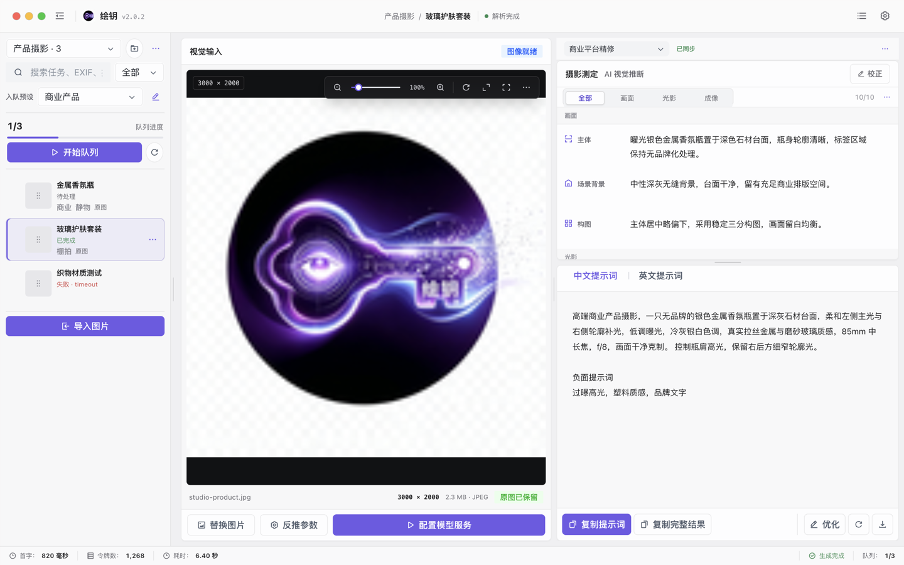
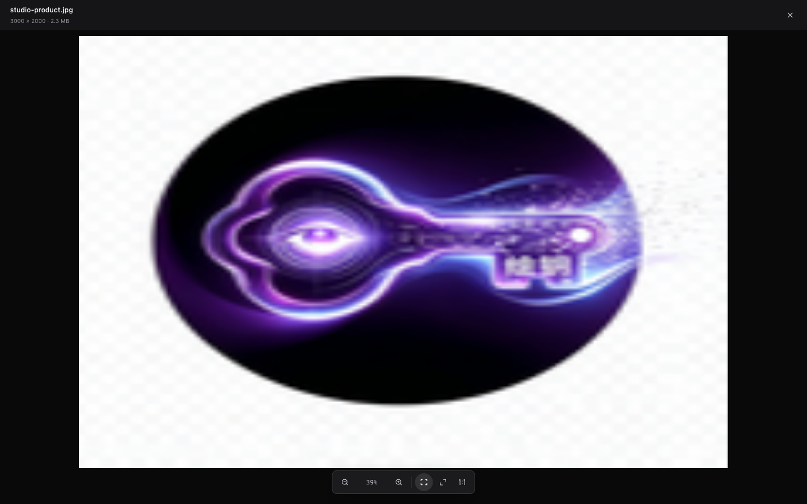
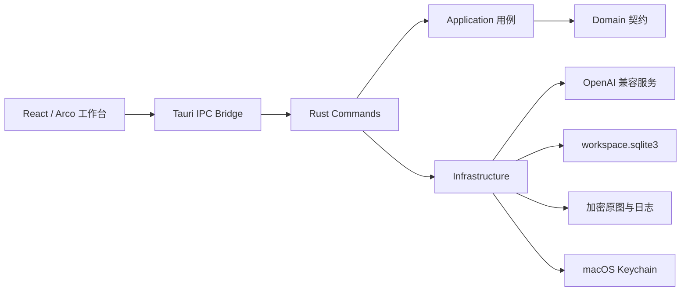

# 绘钥

绘钥是一款使用 React、TypeScript 与 Tauri 2 构建的 macOS 本地数字暗房工作台。它面向摄影师、设计师和内容创作者，以项目和任务组织图片反推、摄影测定、双语提示词、专业精修、批量导出与本地资产管理。

当前版本：`2.0.2` · Bundle ID：`com.huiyao.studio` · 支持 Apple Silicon 与 macOS 12 及以上版本。



## 目录

- [核心能力](#核心能力)
- [下载安装](#下载安装)
- [快速开始](#快速开始)
- [模型服务配置](#模型服务配置)
- [使用流程](#使用流程)
- [开发环境](#开发环境)
- [工程架构](#工程架构)
- [数据与安全](#数据与安全)
- [规格驱动开发](#规格驱动开发)
- [测试与质量检查](#测试与质量检查)
- [构建与发布](#构建与发布)
- [常用命令](#常用命令)
- [故障排查](#故障排查)
- [文档导航](#文档导航)
- [参与贡献](#参与贡献)

## 核心能力

- **项目化工作台**：按项目管理任务、预设、收藏、标签、筛选和废纸篓，任务列表按 50 条分页加载。
- **舒适专业布局**：项目栏压缩次要标签噪声，摄影测定与提示词使用稳定阅读宽度，常用操作直达、危险操作按需确认。
- **批量图片反推**：单次导入最多 100 张 PNG、JPEG 或 WebP，总大小不超过 1 GB；队列支持串行或两个并发。
- **摄影测定**：从画面、光影和成像三个维度输出十项摄影分析，并展示色板和真实 EXIF 白名单信息。
- **双语提示词**：通过真实 SSE 增量输出中文、英文及可选的 SDXL 负面提示词，界面使用自适应打印效果呈现。
- **专业精修**：人工校正、AI 重测、提示词编辑和平台优化统一为可追溯修订；基础结果始终只读。
- **原图保护**：原图使用独立 Keychain 密钥和 XChaCha20-Poly1305 加密后保存在应用私有目录。
- **本地导出**：支持 Markdown、Schema 2 JSON、纯提示词和批量 ZIP；可明确选择是否包含解密后的原图。
- **运行诊断**：按关联请求查看脱敏日志，支持重试、诊断导出和常见模型错误恢复。

绘钥完全本地运行，不提供账号、云同步、团队空间或内置图片生成服务。模型请求只发送到用户配置的 OpenAI Chat Completions 兼容接口。

## 下载安装

从 [GitHub Releases](https://github.com/840103818/huiyao/releases/latest) 下载 `Huiyao_2.0.2_aarch64.dmg`，打开后将“绘钥”拖入“应用程序”。

当前发布包使用 ad-hoc 签名，适合个人或内部使用，未进行 Apple notarization。首次启动若被 macOS 阻止，请在“系统设置 → 隐私与安全性”中确认来源后再次打开。不要从非项目 Release 页面下载重新打包的安装文件。

可使用同一 Release 中的 `.sha256` 文件核对安装包：

```bash
shasum -a 256 -c Huiyao_2.0.2_aarch64.dmg.sha256
```

## 快速开始

1. 启动应用。首次使用会自动创建“我的项目”。
2. 打开“设置”，填写 `Base URL`、模型名称和 `API Key`。
3. 点击“测试连接”。测试成功只表示当前输入可用，仍需点击“保存设置”。
4. 返回工作台，选择内置预设，导入一张或多张图片。
5. 启动队列，查看摄影测定与提示词的实时输出。
6. 在统一修订栏校正分析、同步提示词、比较修订并导出最终结果。

应用重新打开后不会自动继续暂停的队列，避免在用户未确认时产生模型费用。

## 模型服务配置

模型服务需要兼容 OpenAI Chat Completions，并支持图片输入。默认配置仅作为示例，应用不会附带 API Key。

| 设置 | 默认值 | 说明 |
| --- | --- | --- |
| `Base URL` | `https://api.openai.com/v1` | 应填写服务根地址，不要重复附加 `/chat/completions` |
| 模型名称 | `gpt-4.1-mini` | 需使用支持图片输入的模型 |
| `API Key` | 无 | 仅存入 macOS Keychain，不写入设置文件或 WebView |
| 请求超时 | `120` 秒 | 可设置为 10–300 秒 |
| 模型并发数 | `1` | 可选择串行或两个并发；并发会更快地产生费用 |
| 原图软配额 | `10 GB` | 达到 80% 时提醒，超过配额时阻止继续归档 |
| 外观 | 跟随系统 | 支持系统、浅色和深色主题 |

非本机明文 HTTP 地址必须针对准确 Origin 明确确认；地址变化后需要重新确认。模型请求禁止自动重定向，避免 API Key 被转发到意外主机。

## 使用流程

### 项目、导入与队列

1. 在左栏创建或切换项目，并选择“标准反推、商业产品、人物摄影、插画风格”或自定义预设。
2. 通过文件选择、拖入或 `Cmd+V` 导入图片。每张图片最大 20 MB、单边最大 32768px、总像素不超过 8000 万。
3. 启动队列。暂停会等待当前请求完成；停止会取消活动请求并把未处理任务标记为暂停。
4. 单项失败不会阻塞后续任务，可在任务菜单中重试、重命名、移动或删除。

### 结果与专业精修

1. 基础结果生成后，统一修订栏显示当前修订、来源和同步状态。
2. “校正”可编辑十项摄影测定与色板；人工修改自动锁定，AI 重测只更新未锁定字段。
3. 可采用 EXIF 白名单中的相机、镜头和曝光信息。GPS、设备序列号、作者和用户备注不会进入结果或请求。
4. 先保存本地草稿，再选择是否同步提示词。同步失败不会丢失草稿。
5. 每个任务最多保存 12 个派生修订，可比较摄影测定与提示词后导出当前活动修订。

详细操作参见[项目工作台](docs/product/workspace.md)和[专业精修](docs/product/refinement.md)。

### 图片查看器与快捷键

| 操作 | 快捷键或手势 |
| --- | --- |
| 打开快捷命令 | `Cmd+K` |
| 启动生成或停止当前请求 | `Cmd/Ctrl+Enter` |
| 粘贴剪贴板图片 | `Cmd+V` |
| 打开图片查看器 | 图片聚焦后按 `Enter` 或双击 |
| 适应窗口 / 真实 `1:1` / 适应宽度 | `0` / `1` / `2` |
| 缩放图片 | `+`、`-` 或触控板捏合 |
| 平移长图 | 拖动、双指滚动或方向键；`Shift+方向键` 加速 |
| 关闭查看器或停止请求 | `Esc` |
| 恢复默认分栏 | 分隔条双击、`Home` 或 `Enter` |



## 开发环境

### 前置要求

- Apple Silicon Mac，macOS 12 或以上。
- Node.js `>=20.19.0`、npm `>=10`；仓库 `.nvmrc` 使用 Node.js 22。
- Rust `>=1.95.0`、`rustfmt` 和 `aarch64-apple-darwin` 目标。
- Xcode Command Line Tools。生产打包还需要 `ld64.lld`。

在一台新的开发机上执行：

```bash
xcode-select --install
nvm install
nvm use
npm ci
rustup toolchain install stable --profile minimal
rustup default stable
rustup component add rustfmt
rustup target add aarch64-apple-darwin
```

若缺少 `ld64.lld`，可通过 Homebrew 安装 LLVM，并确保其 `bin` 目录位于 `PATH` 中：

```bash
brew install llvm
export PATH="/opt/homebrew/opt/llvm/bin:$PATH"
```

### 启动桌面应用

```bash
git clone https://github.com/840103818/huiyao.git
cd huiyao
npm ci
npm run dev:desktop
```

`dev:desktop` 启动 Vite 与 Tauri，提供模型请求、SQLite、Keychain、原图加密和原生文件对话框等完整桌面能力。

仅调试 React 界面时运行：

```bash
npm run dev
```

Vite 固定监听 [http://127.0.0.1:1420](http://127.0.0.1:1420)。浏览器模式使用脱敏降级数据，不支持真实项目数据库、模型请求、Keychain、原图归档或原生导出。

## 工程架构



前端负责交互、队列调度、流式部分 JSON 展示和浏览器降级；Rust 负责模型请求、取消、容量限制、持久化、原图加密、Keychain、诊断和原生导出。

### 目录结构

```text
src/
  app/                    应用装配、Shell、页面路由和顶层状态
  features/               图片、生成、分析、提示词、项目、设置和诊断
  infrastructure/tauri/   Tauri IPC 与浏览器降级边界
  shared/contracts/       跨功能、跨端数据契约
  styles/                 全局 Token、基础、Arco 和响应式样式
src-tauri/src/
  commands/               Tauri 参数适配和命令注册
  application/            生成、导出等应用用例
  domain/                 领域模型、约束和错误契约
  infrastructure/         HTTP、SQLite、图片、日志、Keychain 和对话框
docs/                     产品、设计、工程、运维、ADR 和任务记录
scripts/                  检查、构建和发布脚本
artifacts/                本地产物目录，不提交 Git
```

依赖方向为 `app/features -> infrastructure/shared` 和 `commands -> application/domain/infrastructure`。`shared` 不得反向依赖具体功能，Rust `domain` 不得依赖 Tauri。详细数据流和兼容边界参见[总体架构](docs/engineering/architecture.md)。

## 数据与安全

- API Key 和原图加密密钥分别保存在 macOS Keychain。
- 原图使用分块 XChaCha20-Poly1305 加密；每个文件使用独立随机 nonce。
- 项目、任务、标签、预设、软删除状态和结果 JSON 保存在启用 WAL 与外键的私有 SQLite 数据库。
- 应用数据目录权限为 `0700`，设置、数据库、日志和加密文件权限为 `0600`。
- WebView 不接收 API Key、原始诊断正文、任意导出路径或原图文件路径。
- 日志不记录图片字节、提示词、优化要求、模型正文、API Key 或本机文件路径。
- 模型请求禁止自动重定向，SSE、完整响应、错误正文和 IPC 字段均有容量限制。
- 删除项目或任务先进入废纸篓并保留 30 天；永久删除和清空操作需要明确确认。

浏览器开发模式不会把原图写入 `localStorage`。完整安全边界、RustSec 例外和报告方式参见[安全说明](docs/engineering/security.md)与[安全策略](SECURITY.md)。

## 规格驱动开发

复杂功能、跨前后端契约、数据迁移、安全边界和大范围 UI 调整使用 OpenSpec 管理。当前稳定行为位于 [`openspec/specs/`](openspec/specs/)，变更中的提案、设计、增量规格和任务位于 `openspec/changes/`；产品、设计和工程文档负责解释使用方式与实现边界，不再作为唯一行为契约。

```text
$openspec-explore
$openspec-propose "变更描述"
$openspec-apply-change
$openspec-archive-change
```

详细命令、工件职责和完整示例参见 [OpenSpec 规格中心](openspec/README.md)与[开发工作流](docs/engineering/openspec.md)。

## 测试与质量检查

运行完整检查：

```bash
npm run check
git diff --check
codegraph sync
```

`npm run check` 会依次执行 npm 锁文件供应链检查、严格 OpenSpec 校验、全部 Vitest 测试、TypeScript/Vite 生产构建、前端依赖环检查、Rust 格式检查、Rust 测试和 Apple Silicon 目标依赖断言。

依赖审计：

```bash
npm audit --registry=https://registry.npmjs.org
cargo audit --file src-tauri/Cargo.lock
```

针对性测试示例：

```bash
npm test -- src/features/analysis/RevisionBar.test.tsx
cargo test --locked --manifest-path src-tauri/Cargo.toml api::tests -- --nocapture
```

涉及界面时还需检查 `1440×900` 浅色、`1120×720` 深色、键盘焦点、弹层主题和横向溢出，并覆盖 `docs/assets/ui/current/` 中受影响的脱敏基线。

## 构建与发布

完整检查并构建 Apple Silicon App 与 DMG：

```bash
npm run package:macos
```

仅在本轮已经运行完整检查后，才使用快速打包：

```bash
npm run package:macos -- --fast
```

产物写入：

```text
artifacts/release/绘钥.app
artifacts/release/绘钥_2.0.2_aarch64.dmg
```

发布脚本检查版本、Bundle ID、图标、本地化、arm64 架构、ad-hoc 签名和 DMG 完整性。正式发布步骤参见[macOS 发布指南](docs/operations/release.md)。

## 常用命令

| 命令 | 用途 |
| --- | --- |
| `npm run dev:desktop` | 启动完整 Tauri 桌面开发环境 |
| `npm run dev` | 仅启动 Vite 浏览器界面 |
| `npm test` | 运行全部前端测试 |
| `npm run test:watch` | 以监听模式运行 Vitest |
| `npm run build` | 执行 TypeScript 检查并构建前端 |
| `npm run check` | 执行前端、Rust 和生产资源完整检查 |
| `npm run spec:list` | 查看活动 OpenSpec 变更 |
| `npm run spec:validate` | 严格校验全部规格和变更 |
| `npm run spec:view` | 打开 OpenSpec 交互视图 |
| `npm run verify:lockfile` | 检查 npm 锁文件来源和完整性摘要 |
| `npm run verify:frontend-dist -- dist` | 检查生产 JavaScript 依赖环 |
| `npm run build:macos:arm64` | 构建 Apple Silicon App 与 DMG |
| `npm run package:macos` | 完整检查、构建、复制并验证发布产物 |
| `npm run verify:release` | 验证 `artifacts/release/` 中的 App 与 DMG |

## 故障排查

### 无法连接模型

- `401/403`：检查 API Key 和模型访问权限。
- `404`：确认 `Base URL` 没有重复包含 `/chat/completions`，并确认模型名称存在。
- `429`：等待限流恢复，或检查账户额度与并发设置。
- “已阻止重定向”：把 Base URL 改为服务最终地址。
- “兼容模式”：服务不支持首选流式参数，应用正在使用兼容路径，不会伪造 SSE 打印动画。

### 应用白屏或构建失败

```bash
npm run build
npm run verify:frontend-dist -- dist
```

生产构建必须保留 Cargo 默认 feature `custom-protocol`，且 Vite 配置只能来自 `vite.config.ts`。如果 Rust 报告 `cfg_select` 为不稳定特性，请确认正在使用 Rust 1.95 或以上：

```bash
rustup update stable
rustup run stable rustc --version
```

### 图片或原图异常

- “仅保留缩略图”表示旧任务没有可恢复原图，重新反推前需要重新选择图片。
- “原图无法解密”通常表示 Keychain 密钥缺失或加密文件损坏；保留结果并先导出脱敏诊断。
- 长图可使用“适应宽度”，再通过拖动、触控板、方向键或位置导航浏览。

更多处理方式参见[故障排查](docs/operations/troubleshooting.md)。

## 文档导航

完整索引和分角色阅读路径参见[文档中心](docs/README.md)。

| 路径 | 入口 |
| --- | --- |
| 使用绘钥 | [产品说明](docs/product/overview.md) · [项目工作台](docs/product/workspace.md) · [专业精修](docs/product/refinement.md) |
| 理解设计 | [设计系统](docs/design/ui-system.md) · [交互规范](docs/design/interaction.md) · [界面基线](docs/assets/ui/current/README.md) |
| 参与开发 | [OpenSpec 规格中心](openspec/README.md) · [总体架构](docs/engineering/architecture.md) · [前端架构](docs/engineering/frontend.md) · [后端架构](docs/engineering/backend.md) · [OpenSpec 工作流](docs/engineering/openspec.md) · [开发指南](docs/operations/development.md) |
| 安全与验证 | [IPC 契约](docs/engineering/ipc-contracts.md) · [安全边界](docs/engineering/security.md) · [测试策略](docs/engineering/testing.md) |
| 构建发布 | [发布指南](docs/operations/release.md) · [版本记录](CHANGELOG.md) · [安全策略](SECURITY.md) |

## 参与贡献

1. 阅读 [AGENTS.md](AGENTS.md) 和 [贡献指南](CONTRIBUTING.md)。
2. 从最新 `master` 创建独立功能分支，不直接在 `master` 开发。
3. 复杂变更先创建 OpenSpec change；保持改动聚焦，为行为变化补充测试，并同步用户说明与技术说明。
4. 页面变化需更新脱敏视觉基线；禁止提交凭证、用户图片、日志、`dist/` 或 `artifacts/`。
5. 提交前运行 `npm run check`、`git diff --check` 和 `codegraph sync`。

本项目使用 [MIT License](LICENSE)。
