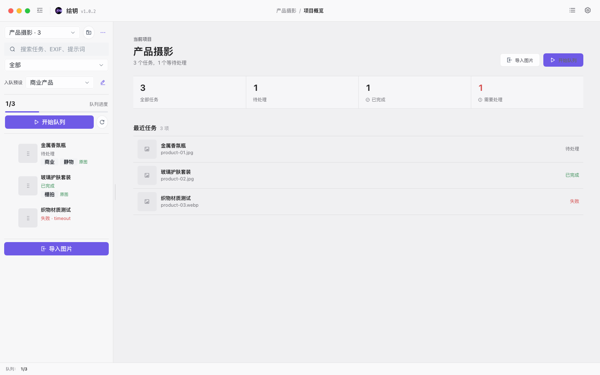
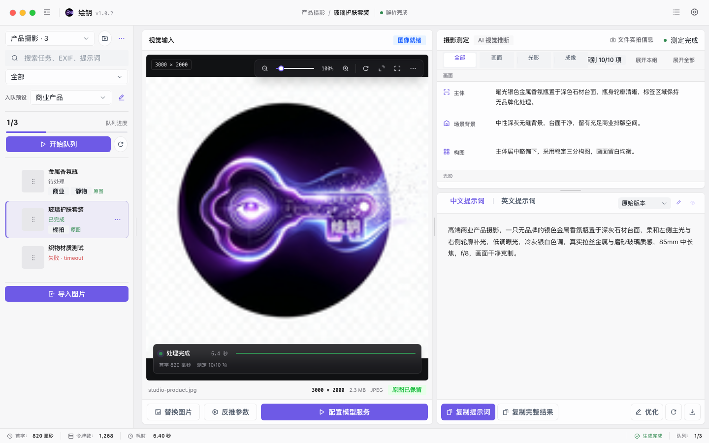
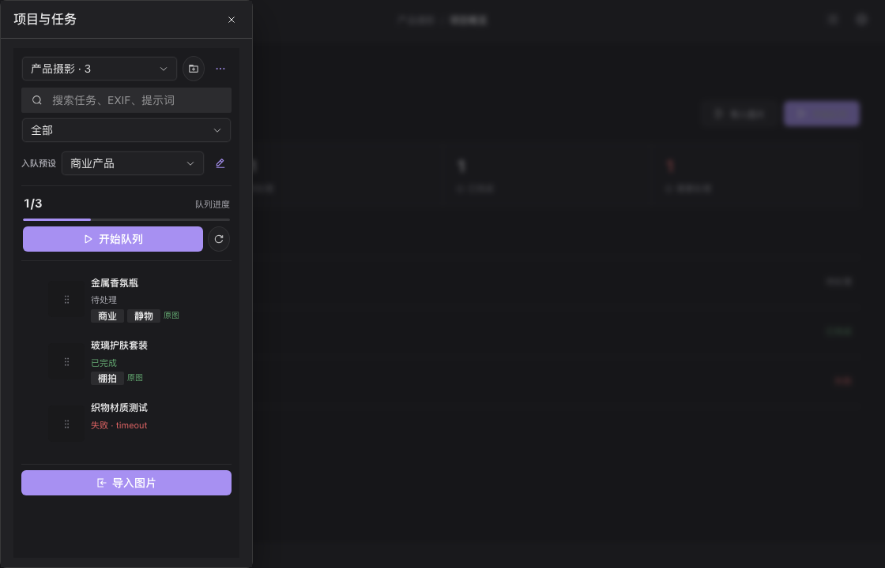

# 绘钥

绘钥是使用 React、TypeScript、Arco Design 和 Tauri 2 构建的 macOS 本地数字暗房工作台。它以项目组织图片任务，批量完成摄影测定、双语提示词和提示词精修，并提供加密原图、EXIF、预设、标签、废纸篓、批量导出与运行诊断。界面采用舒适专业的 Apple 数字暗房风格，以图片和结果为主，减少重复边框、空状态占位和运行状态噪声；项目栏、视觉输入和结果区可按当前工作内容调整宽度。

当前版本：`1.0.2`；Bundle ID：`com.huiyao.studio`；主要发布目标：Apple Silicon、macOS 12 及以上。



## 快速开始

```bash
npm ci
npm run dev:desktop
```

首次使用时应用会创建“我的项目”。在“设置”中配置 OpenAI Chat Completions 兼容服务的 `Base URL`、`API Key` 和模型名，然后导入 1 至 100 张图片并启动队列。浏览器开发模式仅用于旧单图界面调试，不支持项目数据库、模型请求、Keychain、原图加密和原生导出。

## 1.0 工作流

1. 在左栏新建或选择项目，并选择反推预设。
2. 单次导入最多 100 张 PNG、JPEG 或 WebP，总大小不超过 1 GB。
3. 启动队列；默认串行，可在设置中选择两个并发。暂停会等待当前任务结束，停止会取消活动请求。
4. 模型返回 SSE 增量时，摄影测定和双语提示词会以自适应打印效果实时出现；停止后仍可复制已经收到的部分提示词。
5. 使用状态、收藏、原图和全文搜索筛选任务；结果可继续精修或创建关联副本重新生成。
6. 批量导出 Markdown、JSON、纯提示词或原图 ZIP。包含原图时，图片会以未加密形式写入导出文件。
7. 删除内容先进入本地废纸篓，30 天后自动永久清理。

工作台的两条纵向分隔线支持拖动和键盘方向键调整；双击或按 `Home`、`Enter` 恢复默认布局，尺寸会随工作区偏好跨启动保存。

生成时图片区只显示紧凑阶段条、真实耗时和有效进度；完成后阶段条自动收起。空闲状态不会在顶栏和底栏重复显示占位信息。

## 功能预览

选中任务后，视觉输入、摄影测定和提示词保持稳定三栏，提示词操作栏固定在底部：



图片查看器支持适应窗口、适应宽度、真实 `1:1`、长图拖动和导航缩略图：


窄窗口使用项目 Drawer，设置与日志继续保持同一套明暗主题和紧凑工具栏：



## 常用命令

| 命令 | 用途 |
| --- | --- |
| `npm run dev:desktop` | 启动 Tauri 桌面开发环境 |
| `npm run dev` | 仅启动前端界面 |
| `npm test` | 运行前端测试 |
| `npm run build` | 类型检查并构建前端 |
| `npm run check` | 运行前端、Rust 和生产资源完整检查 |
| `npm run verify:lockfile` | 检查 npm 锁文件下载源和完整性摘要 |
| `npm run package:macos` | 完整检查并构建 Apple Silicon 安装包 |
| `npm run package:macos -- --fast` | 跳过完整检查并快速打包 |
| `npm run verify:release` | 验证 `artifacts/release/` 中的 App 和 DMG |

## 工程结构

```text
src/
  app/                 应用装配、Shell 和顶层状态
  features/            图片、生成、分析、提示词、历史、设置、诊断
  infrastructure/      Tauri IPC 与浏览器降级实现
  shared/              跨功能契约和共享能力
  styles/              Token、基础样式、Arco 覆盖和 Shell 样式
src-tauri/src/
  commands/            Tauri 命令适配与注册
  application/         应用用例与结果序列化
  domain/              跨端领域模型和错误契约
  infrastructure/      HTTP、存储、图片、日志、Keychain 和原生能力
docs/                  产品、设计、工程、运维、ADR 和界面基线
artifacts/             本地发布、视觉检查和测试产物，不提交 Git
```

依赖方向、模块边界和数据流参见[架构说明](docs/engineering/architecture.md)。

## 文档导航

- [产品与使用说明](docs/product/overview.md)
- [版本更新记录](CHANGELOG.md)
- [项目工作台操作说明](docs/product/workspace.md)
- [界面设计系统](docs/design/ui-system.md)
- [交互规范](docs/design/interaction.md)
- [总体架构](docs/engineering/architecture.md)
- [前端架构](docs/engineering/frontend.md)
- [后端架构](docs/engineering/backend.md)
- [IPC 契约](docs/engineering/ipc-contracts.md)
- [数据迁移](docs/engineering/data-migration.md)
- [安全边界](docs/engineering/security.md)
- [测试策略](docs/engineering/testing.md)
- [开发指南](docs/operations/development.md)
- [发布指南](docs/operations/release.md)
- [故障排查](docs/operations/troubleshooting.md)
- [架构决策记录](docs/adr/README.md)

## 安全与数据

- API Key 仅保存在 macOS Keychain，不写入 WebView、本地 JSON 或运行日志。
- 模型请求禁止自动重定向；非本机明文 HTTP 地址需要按 Origin 明确确认。
- 原图使用独立 Keychain 密钥和 XChaCha20-Poly1305 加密后保存在应用私有目录。
- 项目、任务、标签、预设和软删除状态保存在启用 WAL 与外键的私有 `workspace.sqlite3` 中。
- 日志不记录图片、提示词正文、API Key 或模型原始正文。
- 结果、日志、诊断和原图通过 Rust 原生保存对话框导出，WebView 不接收任意文件路径。

完整约束参见[安全说明](docs/engineering/security.md)和[安全策略](SECURITY.md)。

## 贡献

修改前阅读 [AGENTS.md](AGENTS.md) 和 [CONTRIBUTING.md](CONTRIBUTING.md)。不要提交凭证、用户图片、运行日志、`dist/`、`artifacts/` 或 Tauri 构建产物。

本项目使用 [MIT License](LICENSE)。
