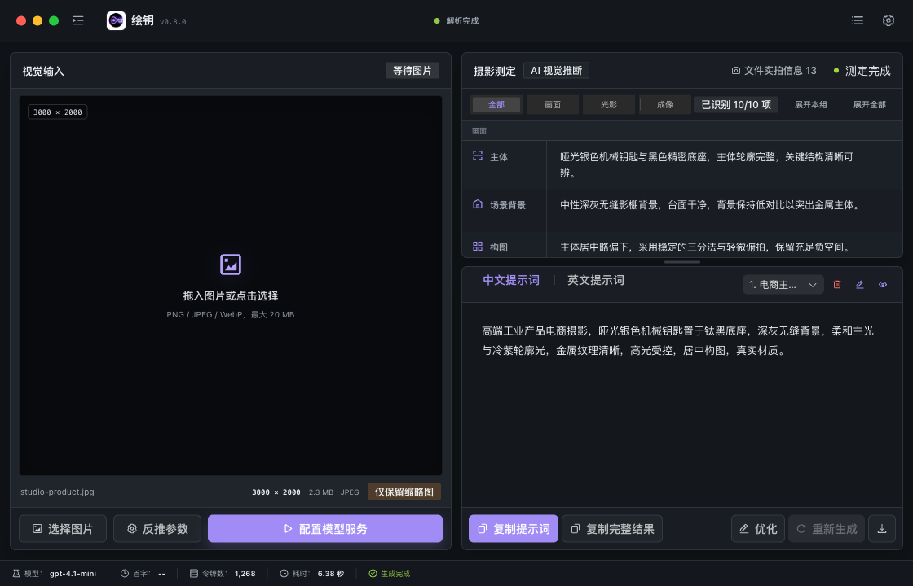
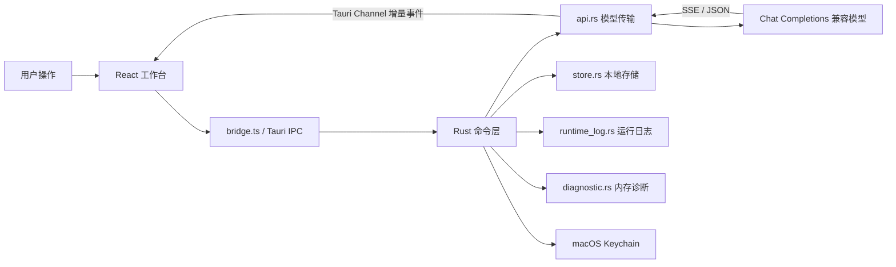

<p align="center">
  
</p>

<h1 align="center">绘钥</h1>

<p align="center">
  面向 macOS 的图片反向提示词工作台。导入一张图片，通过 OpenAI Chat Completions 兼容的多模态模型，<br>
  流式生成摄影测定、中英文提示词和可导出的结构化结果。
</p>

<p align="center">
  
  
  
  
</p>

> 绘钥是本地桌面应用，不包含账号、云同步或内置模型服务。使用前需自行配置支持图片输入的 OpenAI Chat Completions 兼容接口。

## 目录

- [核心功能](#核心功能)
- [界面预览](#界面预览)
- [技术栈](#技术栈)
- [系统要求](#系统要求)
- [安装与首次配置](#安装与首次配置)
- [模型服务兼容性](#模型服务兼容性)
- [使用指南](#使用指南)
- [快捷键与交互](#快捷键与交互)
- [数据与安全](#数据与安全)
- [本地开发](#本地开发)
- [架构](#架构)
- [项目目录](#项目目录)
- [配置与存储](#配置与存储)
- [容量与资源限制](#容量与资源限制)
- [可用命令](#可用命令)
- [测试与质量检查](#测试与质量检查)
- [构建与发布](#构建与发布)
- [常见问题](#常见问题)
- [参与贡献](#参与贡献)

## 核心功能

### 图片反推

- 支持 PNG、JPEG 和 WebP，可点击选择、拖入导入、拖入替换或使用 `Command+V` 粘贴剪贴板图片。
- 请求前在内存中将图片缩放至最长边 2048px，不修改原始文件。
- 可设置补充要求、输出语言和详细程度。
- 生成主体、场景背景、构图、光线、影调曝光、色彩、材质、风格、镜头成像和后期处理十类摄影测定。
- 同时输出中文和/或英文提示词，支持复制、二次优化、手工编辑副本、版本比较和重新生成。
- 二次优化支持通用、Midjourney、Flux 和 SDXL；SDXL 额外生成双语负面提示词。
- 原始反推与模型优化版本始终只读；手工修改保存为派生版本，所有派生版本共用最多 8 个版本限制。
- 可通过原生对话框导出 Markdown、带 `schemaVersion: 1` 的结构化 JSON 或纯提示词文本。

### 文件实拍信息

- 桌面端从本地原图提取相机、镜头、焦距、光圈、快门、ISO、曝光补偿、闪光灯、白平衡、拍摄时间和色彩空间白名单。
- “文件实拍信息”与“AI 视觉推断”在界面中明确分开；无 EXIF 的截图、PNG 或 WebP 正常显示“未提供”。
- GPS、设备序列号、作者、版权和用户备注不会进入前端、历史、日志、导出或模型请求。

### 真实流式输出

- Rust 后端直接解析 OpenAI 兼容 SSE，通过 Tauri Channel 将 Token 增量发送到前端。
- 前端使用 `partial-json` 解析未完成 JSON，视觉字段和提示词随响应逐步显示。
- 最终结果以 Rust 严格 JSON 解析为准，避免将不完整中间态当作最终结果。
- 支持主动停止；部分内容可继续复制，但不会写入历史或导出为完整结果。

### 图片查看器

- 支持触摸板/鼠标指针中心缩放、缩放滑杆和放大后拖动。
- 拖动位置受画布边界约束，窗口尺寸变化后会自动校正。
- 双击放大或复位，查看器打开时隐藏 macOS 原生窗口装饰。
- 具备焦点锁定、关闭后焦点恢复和完整键盘操作。

### 历史与运行诊断

- 最多保留 50 条本地历史；新记录可关联经过 XChaCha20-Poly1305 分块加密的原图。
- 历史恢复后可查看原图、直接重新反推或通过原生对话框导出原文件；旧记录继续使用缩略图降级。
- 历史搜索覆盖标题、文件名、视觉分析和中英文提示词。
- 历史条目右键菜单支持复制中文、复制英文、复制完整结果和修改标题。
- 运行日志页支持实时刷新、级别/类别筛选、请求 ID 复制、关联请求定位和原生导出。
- 生成失败时提供重试、打开设置、查看关联日志和导出脱敏诊断。

### 工作台体验

- Arco Design React 组件体系，默认中文语言环境。
- 支持跟随系统、浅色和深色主题，同步更新 WebView 与 macOS 原生窗口。
- 宽屏显示历史侧边栏；窄于 1240px 时自动收入抽屉。
- 摄影测定和提示词区域可拖动调整比例，并在重启后恢复。
- 最小窗口尺寸为 1120x720，默认窗口尺寸为 1440x900。
- 顶部左侧固定历史栏收起/展开、Logo、应用名和从构建清单读取的版本号；页面切换时品牌位置保持稳定。

## 界面预览

| 1440x900 浅色工作台 | 1120x720 深色工作台 |
| --- | --- |
|  |  |

界面截图固定保存在 `docs/assets/ui/current/`，页面样式修改后覆盖更新，不按版本无限归档。

## 技术栈

| 层级 | 技术 | 用途 |
| --- | --- | --- |
| 桌面容器 | Tauri 2 | macOS 窗口、IPC、原生文件对话框和应用打包 |
| 前端 | React 18 + TypeScript | 工作台界面与交互状态 |
| UI | Arco Design React | 表单、按钮、弹层、表格和主题基础 |
| 构建 | Vite 8 | 前端开发服务器与生产构建 |
| 流式解析 | `partial-json` | 前端渐进解析未完成 JSON |
| 后端 | Rust 2021 | 模型请求、存储、诊断、日志和安全边界 |
| HTTP | `reqwest` + Rustls | HTTPS、SSE 字节流和禁止重定向 |
| 凭证 | `keyring` | macOS Keychain 中的 API Key 存储 |
| 测试 | Vitest + Testing Library + `httpmock` | 前端交互、Rust 单元和 Mock HTTP 测试 |
| CI | GitHub Actions + Dependabot | 构建、测试和依赖安全检查 |

项目不使用数据库、Docker、远程存储或后台任务队列。

## 系统要求

### 运行已构建应用

- macOS 12.0 或更高版本。
- 当前生产构建目标为 Apple Silicon（`arm64`）。
- 可访问的 OpenAI Chat Completions 兼容模型服务。
- 支持视觉/图片输入的模型。

### 本地开发

- macOS 12+，推荐 Apple Silicon 设备。
- Node.js 20.19.0 或更高版本；`.nvmrc` 当前推荐 Node.js 22。
- npm 10 或更高版本。
- Rust stable、`rustfmt` 和 `aarch64-apple-darwin` 目标。
- Xcode Command Line Tools。
- 生产打包需要 `ld64.lld`、`codesign`、`hdiutil`、`lipo`、`plutil`、`ditto` 和 `xattr`。

## 安装与首次配置

### 安装已构建的 DMG

1. 打开 `绘钥_<version>_aarch64.dmg`。
2. 将 `绘钥.app` 拖入 macOS 的“应用程序”目录。
3. 首次启动后打开右上角“设置”。
4. 填写 `Base URL`、`API Key`、模型名称和超时时间。
5. 点击“测试连接”；成功后再点击“保存设置”。

> 当前内部构建使用 ad-hoc 签名，未执行 Apple notarization。如果 Gatekeeper 阻止首次启动，请在 Finder 中右键应用并选择“打开”，再核对应用来源。面向公众分发时必须使用 Developer ID 签名并完成 notarization。

### 设置字段

| 字段 | 说明 | 默认值/限制 |
| --- | --- | --- |
| `Base URL` | OpenAI Chat Completions 兼容服务根地址 | `https://api.openai.com/v1`，最多 2048 字符 |
| `API Key` | 模型服务凭证 | 最多 4096 字符，仅保存到 macOS Keychain |
| 模型名称 | 支持图片输入的模型 ID | `gpt-4.1-mini`，最多 200 字符 |
| 请求超时 | 单次模型请求超时 | 120 秒，可设置 10-300 秒 |
| 自动保存历史 | 生成完成后自动写入本地历史 | 默认开启 |
| 主题 | 同步前端、Arco 弹层和原生窗口外观 | 跟随系统 / 浅色 / 深色 |

“测试连接”只验证当前表单内容，不会自动保存配置。

## 模型服务兼容性

绘钥调用以下兼容端点：

```text
{Base URL}/chat/completions
```

如果 `Base URL` 已以 `/chat/completions` 结尾，应用不会重复追加路径。

模型服务需要支持：

- OpenAI Chat Completions 请求结构。
- `image_url` Data URL 形式的多模态图片输入。
- JSON 文本输出。
- 推荐支持 `stream: true` 的 SSE 输出。

流式兼容策略：

1. 首次请求启用 `stream_options.include_usage`。
2. 如果服务明确返回 `400` / `415` / `422` / `501`，重试不带 `stream_options` 的流式请求。
3. 如果仍不兼容，回退为普通非流式请求。
4. `401` / `403`、`429`、载荷过大和服务端错误不做兼容性重试。

当前不支持 OpenAI Responses API、模型服务商专用协议、代理商自定义鉴权头或账号体系。

### URL 安全规则

- `Base URL` 必须是合法的 `http://` 或 `https://` URL。
- 禁止在 URL 中嵌入用户名、密码或 fragment。
- 非本机的明文 HTTP 地址需要用户针对当前 Origin 明确确认；Origin 改变后需要重新确认。
- `localhost`、`127.0.0.0/8` 和 `::1` 视为本机地址。
- HTTP 客户端不跟随重定向，避免将 API Key 转发到意外地址。

## 使用指南

### 1. 导入图片

- 将 PNG、JPEG 或 WebP 拖入左侧图片画布。
- 也可点击空画布选择文件。
- 已有图片时可直接拖入新图片替换。
- 焦点不在输入框时可按 `Command+V` 粘贴剪贴板图片；替换未保存结果前会再次确认。
- 图片处理或模型生成期间会禁止替换，避免请求与预览不一致。
- 单击图片聚焦画布，双击打开查看器；底部固定提供选择/替换图片、反推参数和开始/停止生成。
- 画布悬浮工具栏提供缩放、复位、适应模式、全屏和更多图片操作。

### 2. 调整输入参数

点击视觉输入底部的“反推参数”，在仅覆盖视觉输入区域的右侧抽屉中调整：

- **补充要求**：最多 500 字符，例如“强调金属质感，排除品牌标识”。
- **输出语言**：中文、英文或中英双语；首次安装默认中文。
- **详细程度**：精简、标准、详细或专家级；首次安装默认专家级。
- **图片适应模式**：在“适应画布”和“填满画布”之间切换。

输出语言、详细程度、图片适应模式和结果区分隔比例会作为工作台偏好独立保存。

### 3. 生成结果

1. 点击“开始反推”。
2. 画布阶段栏真实显示准备图片、连接模型、等待首字、实时解析和整理结果；状态栏同步显示首字时间、令牌数和总耗时。
3. 等待首字超过 8 秒或 20 秒时会显示对应的真实等待提示，不使用虚假完成百分比。
4. 右侧“摄影测定”按画面、光影和成像三组逐项完成，提示词区域随流式内容自动跟随底部。
5. 手动向上滚动提示词后，自动跟随会暂停，避免打断阅读。
6. “复制提示词”复制当前语言；“复制完整结果”复制摄影测定、当前版本双语提示词和生成元数据。
7. 完整结果和 Markdown 导出的生成时间统一使用本地时间 `yyyy-MM-dd HH:mm:ss`。

### 4. 精修与导出

- 点击提示词标题栏的“编辑副本”后，可修改中英文提示词；SDXL 派生版本还可修改双语负面提示词。
- 保存会创建新的手工派生版本，不覆盖原始反推或模型优化版本；历史写入失败时编辑内容保留在抽屉内。
- “版本比较”可并排选择两个版本，查看平台、字符数、生成时间和优化要求，并分别复制当前语言内容。
- 导出菜单提供 Markdown 完整结果、JSON 结构化结果和纯提示词文本；始终只导出当前活动版本。
- “文件实拍信息”展示本机提取的 EXIF 白名单；摄影测定继续表示模型的视觉推断，两者不能混用为同一来源。

### 5. 管理历史

- 左键历史条目恢复分析和提示词。
- 标记“原图已保留”的历史可异步恢复原图并直接重新生成；旧记录或已清理记录只保留缩略图。
- 右键或触摸板双指点按历史条目打开快捷菜单。
- 标题可修改为 1-32 个字符，允许重名。
- 关闭自动保存后，生成完成的提示词标题栏会显示“保存历史”。

### 6. 查看运行日志

1. 点击顶部“运行日志”。
2. 按类别、级别或关键词筛选。
3. 展开一条记录可查看交互 ID、服务商请求 ID、耗时和错误代码等脱敏元数据。
4. 必要时导出 JSON Lines 日志或脱敏诊断 JSON。

## 快捷键与交互

### 工作台

| 操作 | 快捷键/交互 |
| --- | --- |
| 开始生成或重新生成 | `Command+Enter`（macOS）或 `Ctrl+Enter` |
| 粘贴剪贴板图片 | `Command+V`（焦点不在文本输入控件时） |
| 停止生成 | 生成中按 `Esc`，或点击“停止生成” |
| 调整结果区高度 | 拖动摄影测定与提示词之间的分隔条 |
| 键盘调整结果区 | 分隔条获得焦点后按 `↑` / `↓`，`Shift` 可加大步进 |
| 恢复自动结果布局 | 双击分隔条，或在分隔条上按 `Home` / `Enter` |
| 打开历史快捷菜单 | 右键、触摸板双指点按、`Shift+F10` 或菜单键 |
| 聚焦图片画布 | 单击图片 |
| 打开图片查看器 | 聚焦画布后按 `Enter`，或双击图片 |
| 主画布缩放 | 触控板捏合、`+` / `-` |
| 主画布复位 | `0` |
| 移动放大后的图片 | 触控板双指平移或方向键，`Shift` 可加大步进 |

### 图片查看器

| 操作 | 快捷键/交互 |
| --- | --- |
| 放大 | `+` 或 `=` |
| 缩小 | `-` |
| 复位 | `0` |
| 关闭 | `Esc` |
| 快速放大/复位 | 双击图片 |
| 指针中心缩放 | 鼠标滚轮或触摸板缩放手势 |
| 移动 | 放大到 100% 以上后拖动 |

## 数据与安全

### 凭证与请求边界

- API Key 只保存在 macOS Keychain，服务名为 `com.huiyao.studio`。
- API Key 不写入 WebView、`settings.json`、历史、日志或导出文件。
- 模型请求由 Rust 通过 Rustls 发起，前端不直接持有凭证。
- 保存设置时，普通配置与 Keychain 更新使用回滚流程，降低部分保存导致状态不一致的风险。

### 本地数据

- 应用数据目录权限设为 `0700`，设置、历史和日志文件权限设为 `0600`。
- 原图使用独立的随机 256 位 Keychain 密钥和分块 XChaCha20-Poly1305 加密，密文与历史索引分目录保存。
- 原图目录权限为 `0700`、密文文件权限为 `0600`；历史索引不保存原图路径或图片正文。
- 清理全部原图时先将密文移入隔离区，历史索引写入失败会回滚；已提交索引后的遗留隔离文件会在下次启动清理。
- 历史操作串行化写入，避免生成、删除和重命名之间的覆盖竞争。
- 应用启动时会尝试从 `com.reverseprompt.studio` 幂等迁移设置、图片历史、日志和 Keychain 凭证；不覆盖已存在的新数据。

### 日志和诊断

- 日志不记录 API Key、图片 Data URL、补充要求正文、提示词正文或模型原始响应。
- 记录内容以事件、错误代码、模型名、请求 ID、耗时和 Token 数等元数据为主。
- 服务商错误响应只在 Rust 内存中保存脱敏且截断的诊断副本，不返回 WebView。
- 内存诊断最多 5 条、保留 30 分钟；仅能通过用户确认的原生保存对话框导出。

### WebView 安全

- 生产 CSP 仅允许应用资源和 Tauri IPC。
- 开发 CSP 单独允许 `127.0.0.1:1420` 的 Vite 和 WebSocket。
- 导出由 Rust 打开原生文件对话框并写入，WebView 不接收或传递任意输出路径。
- Tauri capability 仅开放主题、窗口拖动和查看器装饰切换所需权限。
- 进行中的模型请求最多 2 个；Tauri Channel 发送失败或应用窗口关闭时会主动取消请求。

请不要将凭证、用户图片、完整请求/响应或运行日志提交到 Git。安全问题请查看 [SECURITY.md](SECURITY.md)。

## 本地开发

### 1. 克隆仓库

```bash
git clone --branch master https://github.com/840103818/huiyao.git
cd huiyao
```

### 2. 安装系统工具

```bash
xcode-select --install
```

使用 [nvm](https://github.com/nvm-sh/nvm) 安装仓库推荐的 Node.js：

```bash
nvm install
nvm use
node --version
npm --version
```

安装 Rust stable 和构建目标：

```bash
rustup toolchain install stable --profile default
rustup default stable
rustup component add rustfmt
rustup target add aarch64-apple-darwin
```

### 3. 安装项目依赖

```bash
npm ci
```

`npm ci` 严格使用 `package-lock.json`，适合新环境、CI 和可重现构建。

### 4. 启动桌面开发环境

```bash
npm run dev:desktop
```

Tauri 会自动启动 Vite，并打开原生 macOS 窗口。Vite 开发地址为 `http://127.0.0.1:1420`。

仅调试前端界面时可使用：

```bash
npm run dev
```

> 浏览器模式可验证 UI、主题和本地历史降级逻辑，但模型请求、Keychain、原生导出和窗口控制仅在 Tauri 桌面运行时可用。

### 运行时配置

应用不依赖 `.env` 文件，也没有必填的运行时环境变量。模型服务配置必须在应用的“系统设置”页中完成。

## 架构

### 边界划分



核心原则是：**WebView 负责展示与交互，Rust 负责凭证、网络、文件和安全边界。**

### 一次反推请求的生命周期

1. `ImageWorkbench` 接收文件或拖放。
2. 桌面端先通过 Raw IPC 让 Rust 校验真实格式和像素尺寸，并提取 EXIF 白名单；前端随后要求系统图片解码器按最长边 2048px 目标尺寸解码，再异步生成请求图和 320px 缩略图。
3. 原始字节由 Rust 加密暂存；模型请求仍只使用 2048px 请求图，提示词优化不再次发送图片。
4. `App.tsx` 通过 `bridge.ts` 调用 `reverse_prompt_stream`。
5. Rust 从 Keychain 读取 API Key，再次验证 URL、请求字段和图片数据。
6. `api.rs` 发起 SSE 请求，处理跨字节块、CRLF、多行 `data:`、Usage 和服务商请求 ID。
7. `started`、`delta` 和 `fallback` 事件通过 Tauri Channel 返回 React。
8. React 渐进解析并渲染中间结果。
9. Rust 严格解析最终 JSON，填充模型、Token、耗时、时间和请求 ID 元数据。
10. 保存历史时，Rust 在同一存储锁中归档加密原图并写入历史索引；失败时回滚到暂存区。

### Tauri IPC 命令

| 命令 | 用途 |
| --- | --- |
| `get_settings` | 读取公开设置和 API Key 存在状态 |
| `save_settings` | 事务式更新模型设置和 Keychain |
| `save_theme` | 立即保存主题，不覆盖未保存的模型表单 |
| `save_workspace_preferences` | 独立保存工作台偏好 |
| `test_connection` | 测试表单中的模型服务配置 |
| `reverse_prompt_stream` | 发起多模态流式反推 |
| `optimize_prompt_stream` | 基于当前提示词和摄影测定进行纯文本流式优化 |
| `cancel_reverse_prompt` | 按交互 ID 取消运行中请求 |
| `load_history` / `save_history` | 读写最近 50 条历史 |
| `stage_original_image` / `discard_original_stage` | 通过 Raw IPC 加密暂存或丢弃原图 |
| `load_original_image` / `export_original_image` | 解密读取或原生导出历史原图 |
| `get_original_storage_stats` / `clear_original_images` | 查看占用或清理全部原图 |
| `load_runtime_logs` / `clear_runtime_logs` | 读取和清空运行日志 |
| `export_result` | 通过原生对话框导出 Markdown、JSON 或纯提示词文本 |
| `export_runtime_logs` | 通过原生对话框导出 JSON Lines |
| `export_diagnostic` | 通过原生对话框导出内存脱敏诊断 |

## 项目目录

```text
.
├── .github/
│   ├── workflows/ci.yml       # macOS CI：审计、测试与构建
│   └── dependabot.yml         # npm、Cargo 和 Actions 依赖更新
├── docs/
│   ├── architecture.md        # 架构边界与数据流
│   ├── development.md         # 开发与界面验证约定
│   └── release.md             # Apple Silicon 发布流程
├── scripts/
│   ├── check.sh               # 统一质量检查
│   ├── build-macos-arm64.sh   # Tauri arm64 App/DMG 构建
│   ├── package-macos-arm64.sh # 检查、构建、复制和验证
│   └── verify-release.sh       # 签名、架构、Bundle 和 DMG 校验
├── src/
│   ├── App.tsx                # 应用组合、生成状态和历史协调
│   ├── components/
│   │   ├── ImageWorkbench.tsx # 图片画布、参数和查看器
│   │   ├── ResultsWorkspace.tsx # 动态结果分隔布局
│   │   ├── ResultPanel.tsx     # 摄影测定
│   │   ├── PromptPanel.tsx     # 提示词与错误恢复
│   │   ├── Sidebar.tsx         # 历史、搜索和右键菜单
│   │   ├── SettingsView.tsx    # 模型、历史和主题设置
│   │   └── LogsView.tsx        # 运行日志与诊断
│   ├── lib/
│   │   ├── bridge.ts          # 唯一 IPC 入口和浏览器降级实现
│   │   ├── image.ts           # 图片预处理
│   │   └── stream.ts          # partial JSON 解析
│   ├── types.ts               # 前端跨层类型
│   └── styles.css             # 主题 Token 和领域布局
├── src-tauri/
│   ├── src/
│   │   ├── lib.rs             # Tauri 命令、Keychain 和应用状态
│   │   ├── api.rs             # URL 校验、HTTP、SSE、回退和请求取消
│   │   ├── models.rs          # IPC 和存储数据结构
│   │   ├── store.rs           # 安全文件存储和旧数据迁移
│   │   ├── original_image.rs  # 原图校验、分块加密和生命周期
│   │   ├── runtime_log.rs     # JSON Lines 日志
│   │   └── diagnostic.rs      # 短期内存诊断与脱敏
│   ├── capabilities/default.json # Tauri 最小权限
│   ├── icons/                 # macOS 与其他 Tauri 图标尺寸
│   └── tauri.conf.json        # 窗口、CSP、Bundle 和签名配置
├── package.json                    # npm 依赖和命令
└── README.md
```

## 配置与存储

### 数据位置

macOS 上的预期应用数据目录为：

```text
~/Library/Application Support/com.huiyao.studio/
├── settings.json   # 非敏感设置和工作台偏好
├── history.json    # 最近 50 条结果、缩略图和原图元数据
├── originals/      # 以历史 ID 命名的加密原图
├── original-staging/ # 尚未归档的加密暂存文件
└── runtime.jsonl   # 脱敏运行日志
```

API Key 和独立的原图加密密钥位于 macOS Keychain，不在上述目录中。诊断响应只位于 Rust 进程内存中。

> 实际目录由 Tauri `app_data_dir()` 计算；如果操作系统或 Tauri 路径策略发生变化，以运行时返回路径为准。

### 工作台偏好

| 偏好 | 可选值 | 默认值 |
| --- | --- | --- |
| 输出语言 | `chinese` / `english` / `bilingual` | `chinese` |
| 详细程度 | `concise` / `standard` / `detailed` / `expert` | `expert` |
| 图片适应 | `contain` / `cover` | `contain` |
| 结果区分隔比例 | 28%-66% 或自动 | 自动 |

## 容量与资源限制

以下限制在前端和/或 Rust 边界实施，用于防止过大输入、无限 SSE 和本地文件无界增长。

| 资源 | 限制 |
| --- | --- |
| 原始图片文件 | 20 MiB |
| 原始图片最长边 | 32768px |
| 原始图片总像素 | 8000 万 |
| 原图暂存区 | 最多 5 个文件、合计 100 MiB |
| 模型请求图最长边 | 2048px |
| 历史缩略图最长边 | 320px |
| 图片 Data URL | 32 MiB |
| 补充要求 | 500 字符 |
| SSE 总传输量 | 4 MiB |
| 流式模型正文 | 1 MiB |
| SSE 未完成缓冲 | 512 KiB |
| 普通完整响应 | 2 MiB |
| 错误响应/诊断正文 | 256 KiB |
| 原生导出文件 | 24 MiB |
| 历史条数 | 50 |
| 单条历史优化版本 | 8 |
| 同时运行的模型请求 | 2 |
| 单条历史 | 2 MiB |
| 历史文件 | 32 MiB |
| 运行日志 | 最多 500 条，文件阈值 2 MiB |
| 内存诊断 | 最多 5 条，30 分钟过期 |

## 可用命令

| 命令 | 说明 |
| --- | --- |
| `npm run dev` | 启动 Vite 前端开发服务器 |
| `npm run dev:desktop` | 启动 Vite + Tauri 原生开发应用 |
| `npm test` | 使用 Vitest 运行全部前端测试 |
| `npm run test:watch` | 以监视模式运行 Vitest |
| `npm run build` | TypeScript 项目构建和 Vite 生产构建 |
| `npm run check` | 顺序运行前端测试、前端构建、Rust 格式检查和 Rust 测试 |
| `npm run tauri -- <args>` | 调用项目内 Tauri CLI |
| `npm run build:macos:arm64` | 构建 arm64 `.app` 和 `.dmg` 到临时 target 目录 |
| `npm run package:macos` | 执行完整检查、构建、复制到 `release/` 并验证 |
| `npm run package:macos -- --fast` | 跳过重复的 `npm run check`，直接构建和验证 |
| `npm run verify:release` | 验证默认 `release/` 中的 App 和 DMG |

Rust 子项目可直接使用：

```bash
cargo fmt --manifest-path src-tauri/Cargo.toml --check
cargo test --manifest-path src-tauri/Cargo.toml
cargo check --manifest-path src-tauri/Cargo.toml
```

## 测试与质量检查

### 完整检查

```bash
npm run check
```

`scripts/check.sh` 会在任一步失败时立即退出，执行顺序为：

1. `npm test`
2. `npm run build`
3. `cargo fmt --check`
4. `cargo test`

### 针对性测试

```bash
# 单个前端测试文件
npm test -- src/components/ImageWorkbench.test.tsx

# Rust API 模块测试
cargo test --manifest-path src-tauri/Cargo.toml api::tests

# 显示 Rust 测试输出
cargo test --manifest-path src-tauri/Cargo.toml -- --nocapture
```

### 安全审计

```bash
npm audit --omit=dev --registry=https://registry.npmjs.org
cargo install cargo-audit
cargo audit --file src-tauri/Cargo.lock
```

CI 在 `macos-14` 上执行 npm 生产依赖审计、前端测试/构建、Rust 格式/测试和 RustSec 审计。GitHub Actions 使用固定 commit SHA，Dependabot 每周检查 npm、Cargo 和 Actions 依赖。

### 界面验证

界面改动至少需要检查：

- 1440x900 浅色与深色主题。
- 1120x720 最小窗口。
- 空状态、流式中间态、完整长文结果和错误恢复。
- 历史抽屉、右键菜单、设置、日志和图片查看器。
- 横向溢出、文字重叠、焦点顺序和键盘操作。

项目约定优先使用 `browser-skill`，不可用时使用 Playwright。修改完成后运行：

```bash
codegraph sync
git diff --check
```

## 构建与发布

### 安装生产链接工具

构建脚本使用 `ld64.lld`。可通过 Homebrew LLVM 提供：

```bash
brew install llvm
export PATH="$(brew --prefix llvm)/bin:$PATH"
command -v ld64.lld
```

### 一键生产打包

```bash
npm run package:macos
```

该命令会：

1. 检查运行环境和 `aarch64-apple-darwin` Rust 目标。
2. 运行 `npm run check`。
3. 使用 Tauri 构建 `.app` 和 `.dmg`。
4. 复制产物到仓库本地 `release/`。
5. 验证 Bundle ID、版本、图标、arm64 架构、代码签名和 DMG 校验和。

已在当前修改上完成检查时，可使用：

```bash
npm run package:macos -- --fast
```

### 构建产物

```text
/tmp/huiyao-target/aarch64-apple-darwin/release/bundle/
├── macos/绘钥.app
└── dmg/绘钥_<version>_aarch64.dmg

release/
├── 绘钥.app
└── 绘钥_<version>_aarch64.dmg
```

`release/` 被 `.gitignore` 忽略，不应提交到仓库。

### 构建环境变量

| 变量 | 用途 | 默认值 |
| --- | --- | --- |
| `CARGO_TARGET_DIR` | 覆盖 Rust/Tauri 产物目录 | `/tmp/huiyao-target` |
| `CARGO_PROFILE_RELEASE_STRIP` | 控制 release strip | `none` |
| `RUSTFLAGS` | 覆盖 Rust 链接参数 | `-C link-arg=-fuse-ld=lld` |

### 版本号同步

发布前必须同步以下位置：

- `package.json`
- `package-lock.json`
- `src-tauri/Cargo.toml`
- `src-tauri/Cargo.lock`
- `src-tauri/tauri.conf.json`
- `src/components/Toolbar.tsx`

### 签名与公开分发

当前 `tauri.conf.json` 使用 `signingIdentity: "-"` 进行 ad-hoc 签名，适合内部测试或本机使用。公开分发前至少需要：

1. 配置 Apple Developer ID Application 签名身份。
2. 使用开发者凭证重新签名。
3. 提交 Apple notarization。
4. 将 notarization ticket staple 到 App/DMG。
5. 在干净 macOS 环境上验证 Gatekeeper。

项目当前不包含自动更新器，也不将 ad-hoc 构建描述为可公开分发产物。

## 常见问题

### 点击“开始反推”后跳转到设置

应用未在 Keychain 中找到 API Key。在“系统设置”中填写 API Key，测试连接后点击“保存设置”。

### 测试连接成功，但重启后配置没有变化

“测试连接”不保存配置。测试成功后还需要点击“保存设置”。

### `401` 或 `403`

API Key 无效，或当前凭证无权访问所填模型。请检查 Keychain 中的凭证和模型权限。

### `404`

`Base URL` 路径或模型名称不存在。如果服务文档给出的是完整 `/chat/completions` 端点，可直接填写完整路径。

### `429`

请求过于频繁或账户额度不足。该错误不会触发流式兼容性重试，请等待限流窗口或检查服务商配额。

### 提示“已阻止重定向”

为避免 API Key 转发到意外域名，绘钥不跟随 HTTP 重定向。请将 `Base URL` 修改为服务返回的最终 HTTPS 地址。

### 提示确认明文 HTTP

非本机 HTTP 会以明文传输 API Key 和图片请求。只应在信任的内网中确认，生产环境应使用 HTTPS。

### 提示“兼容模式”

服务不支持 `stream_options` 或 SSE，应用已自动重试或回退到普通请求。回退模式只显示最终结果，不会伪造逐字流式效果。

### 提示流式中断或响应过大

流式连接未以 `[DONE]` 正常结束，或响应超出安全上限。可先重试，再尝试降低详细程度、更换模型，并通过关联日志确认网关是否中断 SSE。

### 恢复历史后无法重新生成

只有标记“原图已保留”的 0.7.0 新记录可以恢复原图并直接重新生成。旧历史或已清理原图的记录仍只有缩略图，需要重新选择原始图片。

### 直接运行 `npm run dev` 时无法请求模型

模型传输和 Keychain 命令只在 Tauri 运行时中可用。需要完整功能时请使用 `npm run dev:desktop`。

### Vite 报告 1420 端口被占用

`vite.config.ts` 启用了 `strictPort`。关闭占用 `127.0.0.1:1420` 的进程后重试：

```bash
lsof -nP -iTCP:1420 -sTCP:LISTEN
```

### Cargo 全局缓存出现 `Permission denied`

如果最终编译或测试退出码为 0，缓存自动清理警告不影响项目结果。若编译本身失败，请检查 `~/.cargo/registry` 的所有者和权限，不要使用 `sudo cargo`。

### 发布验证报告 `resource fork` 或 `Finder information`

清理 App bundle 扩展属性后重新验证：

```bash
xattr -cr release/绘钥.app
npm run verify:release
```

如果项目位于 iCloud Drive 或文件提供商同步目录，属性可能被重新添加。请在本地非同步目录重试打包。

## FAQ

### 绘钥会上传或长期保存原图吗？

反推时，最长边缩放至 2048px 的副本会发送给用户配置的模型服务。原始文件字节不会随二次优化请求发送；它们会用 Keychain 密钥加密后保存在当前 Mac 的应用私有目录。绘钥自身没有云存储，可在设置中查看占用或永久清理全部原图。

### 可以不保存历史吗？

可以。在设置中关闭“自动保存生成结果到历史记录”。完整结果仍可手动保存。

### 为什么日志中看不到完整模型响应？

这是安全设计。运行日志只保留脱敏元数据。需要进一步排查时，可在失败详情中导出有时效的脱敏诊断文件。

### 支持 Intel Mac 吗？

当前发布脚本和产物仅验证 `aarch64-apple-darwin`。源码中的 Tauri/React 技术栈可能在 Intel Mac 上编译，但项目尚未将 x86_64 列为受支持发布目标。

### 支持云同步或多设备历史吗？

不支持。所有设置、历史和运行日志都保存在当前 Mac。

## 参与贡献

1. 从最新 `master` 创建功能分支。
2. 保持改动聚焦，行为变更必须更新或增加测试。
3. 提交前运行 `npm run check` 和 `codegraph sync`。
4. 界面改动需附 1440x900、1120x720 与明暗主题验证结果。
5. Pull Request 中说明用户影响、风险、测试方式和必要截图。

详细约定见 [CONTRIBUTING.md](CONTRIBUTING.md)。

## 相关文档

- [架构说明](docs/architecture.md)
- [开发指南](docs/development.md)
- [macOS 发布指南](docs/release.md)
- [安全策略](SECURITY.md)
- [贡献指南](CONTRIBUTING.md)

## 许可证

本项目使用 [Apache License 2.0](LICENSE)。
