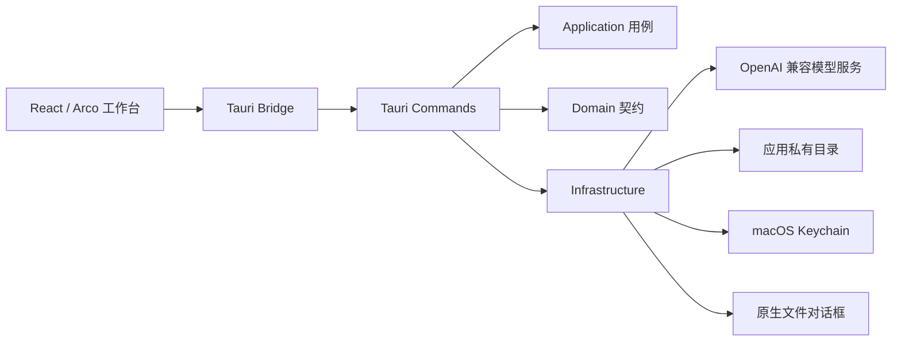

# 总体架构

## 系统边界



WebView 只处理交互、图片预览和部分 JSON 展示。模型凭证、网络请求、原图加密、持久化和任意文件写入均位于 Rust 边界内。

## 前端依赖方向

```text
app -> features -> infrastructure/shared
app -> infrastructure/shared
infrastructure -> shared/contracts
shared -X-> app/features
```

`app/` 负责装配和页面路由；`features/` 按业务能力聚合；`infrastructure/tauri/` 是跨进程边界；`shared/` 不依赖具体功能。详见[前端架构](frontend.md)。

## Rust 依赖方向

```text
bootstrap -> commands -> application/domain/infrastructure
application -> domain
infrastructure -> domain
domain -X-> tauri
```

命令文件按设置、生成、存储、导出和运行装配拆分。为保持 Tauri 宏名称和内部辅助函数兼容，命令与部分基础设施通过 `include!` 组成单一模块命名空间；新增业务逻辑优先进入 `application/`，不得继续扩张命令适配层。

## 反推数据流

1. 前端校验格式并生成预览、缩略图和最长边 2048px 的模型输入。
2. 桌面端通过 Raw IPC 将原图字节暂存到 Rust 加密区。
3. `reverse_prompt_stream` 获取请求槽、读取设置和 Keychain API Key。
4. HTTP 基础设施构建多模态请求并解析 SSE；Channel 只传递 started、delta 和 fallback。
5. 前端按动画帧合并增量并解析部分 JSON，最终以 Rust 严格解析结果为准。
6. 结果与原图提交在历史写入锁内完成；失败时结果保留并提供重试。

## 兼容边界

- Tauri 命令名、Channel 事件和 camelCase 序列化字段是稳定接口。
- `PublicSettings`、`WorkspacePreferences`、`HistoryItem` 和 `ReverseResult` 使用 serde 默认值兼容旧数据。
- Keychain 服务名、应用数据目录和 Bundle ID 不因代码目录调整而变化。
- 浏览器降级序列化与 Rust 原生导出必须保持同一 schema。
